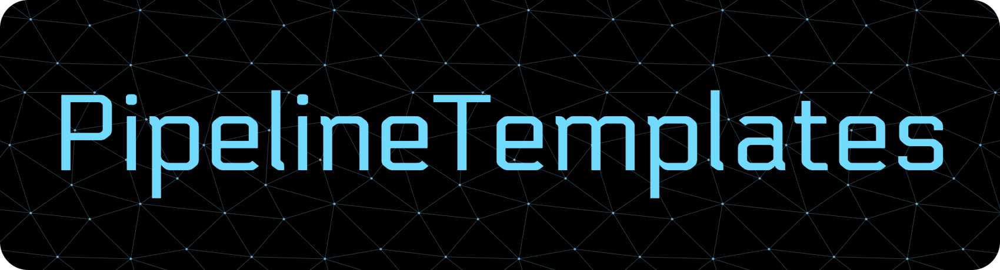

<!-- Repo Banner -->

  

<!-- Git Badges -->

  
  
  
  

Reusable pipeline templates for CI/CD technologies like Github Actions, Gitlab Pipelines, and Concourse CI. [Check the docs](./docs/) for more information, including development documentation for creating new pipelines, usage documentation for each platform, & examples.

> [!TIP]
> I use a separate repository, [`PipelineTemplates-Test`](https://github.com/redjax/PipelineTemplates-Test), to demonstrate and mock integrations with components from this repository. The test repository includes Docker containers, Go applications, and other supporting services, along with example pipelines that consume components from this repository for demonstration and validation runs.

## Description

Centralized repository where I store my CI/CD pipelines & components. Each component is versioned individually (read the [versioning docs](./docs/versioning/)) and creates a git tag so they are idempotent/repeatable; each time a pipeline is called from the same ref/tag, it will do the same thing.

As much "business logic" as possible is separated into script files so they can be re-used in other CI/CD platforms. Pipelines/components are essentially wrappers around these scripts, so moving from i.e. Github Actions to Gitlab Pipelines is simpler, only the script calling logic and inputs need to be translated. Some more complex pipelines, like Github reusable workflows that use an execution matrix, may require additional engineering to convert between platforms.

This repository currently has a bias towards Github (2026-05-25), as that is where the code is hosted and where most of my repositories live. As components for other platforms are added, I will update the documentation with differences and pipeline conversion examples.
