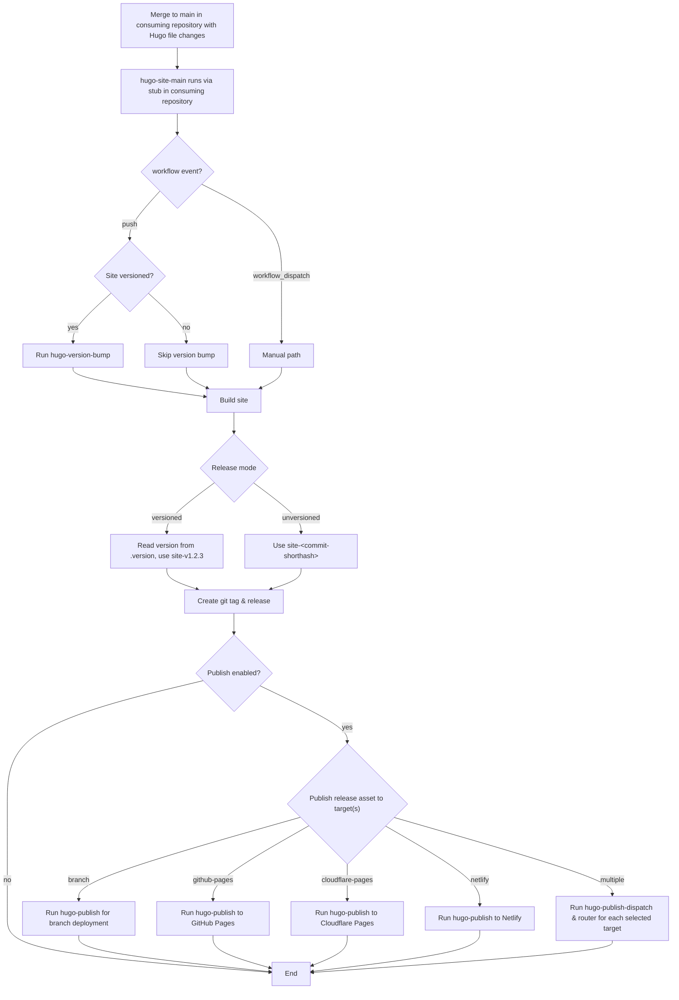
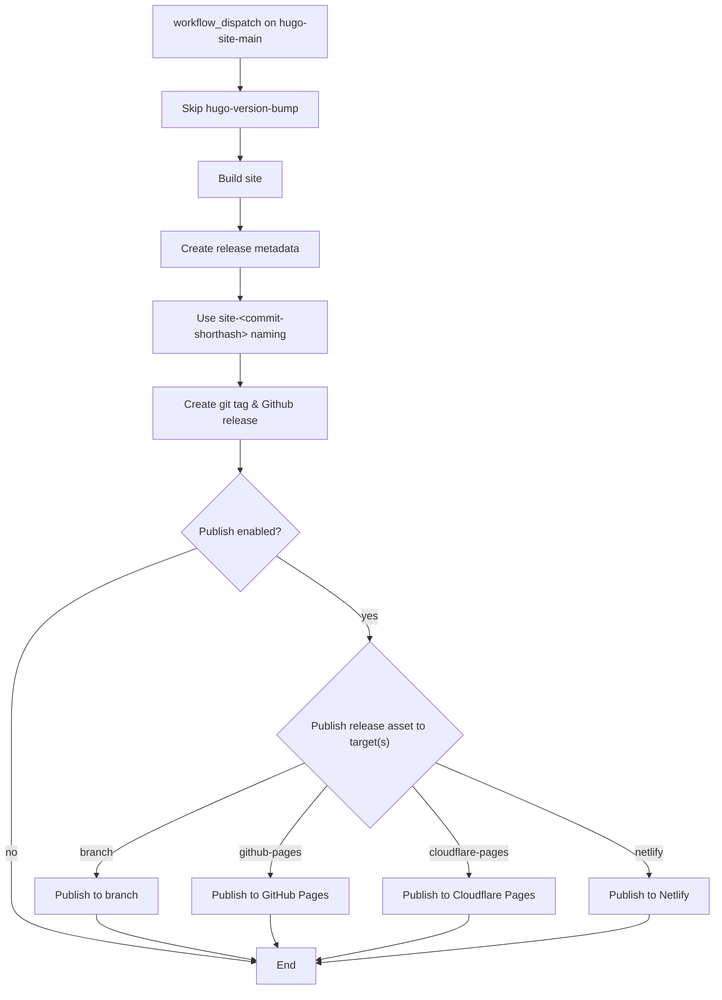

# Hugo Site Main Pipeline <!-- omit in toc -->

The `hugo-site-main` workflow is the orchestration pipeline for Hugo sites. It coordinates the shared Hugo workflows in this repository:

- [`hugo-version-bump`](../hugo-version-bump)
- [`hugo-build`](../hugo-build)
- [`hugo-gh-release`](../hugo-gh-release)
- [`hugo-publish-dispatch`](../hugo-publish-dispatch)
- [`hugo-publish-router`](../hugo-publish-router)
- [`hugo-publish-branch`](../hugo-publish-branch)
- [`hugo-publish-gh-pages`](../hugo-publish-gh-pages)
- [`hugo-publish-cloudflare-pages`](../hugo-publish-cloudflare-pages)
- [`hugo-publish-netlify`](../hugo-publish-netlify)

This workflow is intended to be called from a thin workflow stub in a consuming repository. The caller passes repository-specific inputs such as site path, versioning behavior, runner selection, and optional publish targets, and this pipeline conditionally runs the other workflows to build and release the Hugo site in the consuming repository.

Automatic runs on `push` perform the bump step only when `versioned` is true. Some repositories are versioned with [`bump-my-version`](https://github.com/callowayproject/bump-my-version), while others are raw Hugo sites. This pipeline supports both. Manual runs also skip the bump step.

When releasing an un-versioned site, or on manual runs, the commit short SHA is used instead of a version tag. For example, the Git tag and GitHub release will be named something like `site-f52f891`, and the release artifacts `site-f52f891.tar.gz` and `site-f52f891.zip`.

Publishing is optional and controlled by `publish-targets`, a JSON array of destination names. Supported targets:

- `branch`
- `github-pages`
- `cloudflare-pages`
- `netlify`

## Table of Contents <!-- omit in toc -->

- [Responsibilities](#responsibilities)
- [Inputs](#inputs)
- [Secrets](#secrets)
- [Release flows](#release-flows)
  - [Automatic on merge to main](#automatic-on-merge-to-main)
  - [Manual trigger](#manual-trigger)
- [Example Consuming Repository Pipeline Stub](#example-consuming-repository-pipeline-stub)

## Responsibilities

- Run a version bump for versioned sites on automatic runs.
- Build the Hugo site and upload to pipeline artifact.
- Create the Git tag and GitHub Release, with `.tar.gz` and `.zip` archives as release assets.
- Optionally publish to a destination such as GitHub Pages, Cloudflare Pages, a branch in Github, or Netlify.
- Support both automatic and manual release flows.

## Inputs

- `site-root`: Root path of the Hugo site in the caller repository.
- `versioned`: Whether the site uses versioned releases.
- `version-file`: Relative path to the version file.
- `bump-script`: Path to the version bump script in the templates repository.
- `bump-config`: Path to the bump configuration file.
- `artifact-name`: Name of the uploaded build artifact.
- `release-prefix`: Prefix used for generated release tags.
- `publish-targets`: JSON array of publish targets, e.g. `["github-pages","branch"]`.
- `branch-name`: The name of the branch to publish to when `branch` is a target.
- `cloudflare-pages-branch`: Branch name reported to Cloudflare Pages.
- `cloudflare-pages-project`: Cloudflare Pages project name.
- `netlify-site-id`: Netlify site ID.
- `netlify-branch`: Branch name reported to Netlify.
- `netlify-dir`: Directory to deploy to Netlify.
- `runner-image`: Runner label or image to use.
- `templates-ref`: Ref used to checkout the templates repository for shared scripts.
- `hugo-build-flags`: Additional build flags for [`hugo-build` workflow](../hugo-build/), i.e. `--gc` or `--minify`.
- `use-hugo-cache`: Enable/disable Hugo build cache.
- `clean-hugo-cache`: Clean Hugo generated cache before build.
- `debug-hugo-build-state`: Enable debug printing of the Hugo state path in the pipeline.

## Secrets

The following secrets are required in the consuming repository (set them as Actions secrets in the repository's settings):

- `release-bot-pat`: PAT used for release PR creation and merge operations (`RELEASE_BOT_PAT`).
- `cloudflare-api-token`: (optional) Used for Cloudflare publishing targets (`CLOUDFLARE_API_TOKEN`).
- `cloudflare-account-id`: (optional) Used for Cloudflare publishing targets (`CLOUDFLARE_ACCOUNT_ID`).
- `netlify-auth-token`: (optional) Used for Netlify publishing targets (`NETLIFY_AUTH_TOKEN`).

The `RELEASE_BOT_PAT` is a [Github Personal Access Token (PAT)](https://docs.github.com/en/authentication/keeping-your-account-and-data-secure/managing-your-personal-access-tokens), and requires the following permissions:

- Actions: Read and write
- Contents: Read and write
- Workflows: Read and write

The `CLOUDFLARE_API_TOKEN` is a [Cloudflare API token](https://developers.cloudflare.com/fundamentals/api/get-started/create-token/) and requires the `Pages: Write` permission.

## Release flows

### Automatic on merge to main

Runs on any merge to `main` where there are changes to 1 or more Hugo site files, i.e.:

- `archetypes/**`
- `content/**`
- `data/**`
- `i18n/**`
- `static/**`
- `hugo.yml`
- `go.mod`
- `go.sum`



### Manual trigger



## Example Consuming Repository Pipeline Stub

> [!NOTE]
> You will need to change some of the values below depending on the type of repository calling the `hugo-site-main.yml` pipeline. At minimum you will likely need to update:
>
> - `site-root`: The path to the raw Hugo site files (default: `"."`, assumes Hugo was initialized at the repository root)
>   - If a Hugo site is nested in a subdirectory in the consuming repository, i.e. in `apps/hugo-site/`, set `site-root` to the relative path from the repository root.
> - `versioned`: Boolean value that determines if the [version bump step](../hugo-version-bump/) runs (default: `false`)
>   - When `true`, the `version-file` and a `.bumpversion.toml` file must exist in the consuming repository.
>   - The version bumping is handled by [`bump-my-version`](https://github.com/callowayproject/bump-my-version)
> - `version-file`: ".version"
>
> The consuming repository must also set the `RELEASE_BOT_PAT`, `CLOUDFLARE_API_TOKEN`, `CLOUDFLARE_ACCOUNT_ID`, and (optionally) `NETLIFY_AUTH_TOKEN` [repository secrets](#secrets).

```yaml
***
name: Hugo Site Main

on:
  push:
    branches:
      - main
    paths:
      - "apps/hugo-site/archetypes/**"
      - "apps/hugo-site/content/**"
      - "apps/hugo-site/data/**"
      - "apps/hugo-site/i18n/**"
      - "apps/hugo-site/static/**"
      - "apps/hugo-site/hugo.yml"
      - "apps/hugo-site/go.mod"
      - "apps/hugo-site/go.sum"

  workflow_dispatch:
    inputs:
      publish-targets:
        description: 'JSON array of publish targets, e.g. ["github-pages","branch"]'
        type: string
        required: false
        default: '["github-pages","branch"]'
      branch-name:
        type: string
        required: false
        default: "gh-pages"
      cloudflare-pages-project:
        type: string
        required: false
        default: "pipelinetemplates-test"
      cloudflare-pages-branch:
        type: string
        required: false
        default: "main"
      runner-img-or-label:
        type: string
        default: ubuntu-latest
      use-hugo-cache:
        type: boolean
        required: false
        default: true
      clean-hugo-cache:
        type: boolean
        required: false
        default: false

jobs:
  pipeline:
    permissions:
      contents: write
      actions: write
      pull-requests: write
      pages: write
      id-token: write
    uses: redjax/pipelinetemplates/.github/workflows/hugo-site-main.yml@main
    with:
      ## Relative path from root where Hugo site was initialized
      site-root: "."
      ## If the site is versioned with bump-my-version, set to true
      versioned: false
      ## File bump-my-version uses to track version. Must exist in the
      #  consuming repository. Path should be relative to site-root value
      version-file: ".version"
      ## Name of the pipeline artifact
      artifact-name: "hugo-site"
      ## Prefix for tags/releases, i.e. <prefix>-v1.2.3(.tar.gz/.zip)
      release-prefix: "site"
      ## Publish targets controlling destinations
      publish-targets: ${{ inputs.publish-targets || '["github-pages","branch"]' }}
      ## Branch name where site is published when "branch" is a target
      branch-name: ${{ inputs.branch-name || 'gh-pages' }}
      ## Cloudflare Pages project name
      cloudflare-pages-project: ${{ inputs.cloudflare-pages-project || 'pipelinetemplates-test' }}
      ## Branch to deploy to Cloudflare Pages
      cloudflare-pages-branch: ${{ inputs.cloudflare-pages-branch || 'main' }}
      ## A label or supported runner image, for example 'self-hosted' if your selfhosted runner uses that label
      runner-image: ${{ inputs.runner-img-or-label || 'ubuntu-latest' }}
      ## PipelineTemplates repository ref for checkout step
      templates-ref: main
      ## Enable/disable Hugo build cache
      use-hugo-cache: ${{ inputs.use-hugo-cache || true }}
      ## Clean Hugo generated cache before build
      clean-hugo-cache: ${{ inputs.clean-hugo-cache || false }}
    secrets:
      release-bot-pat: ${{ secrets.RELEASE_BOT_PAT }}
      cloudflare-api-token: ${{ secrets.CLOUDFLARE_API_TOKEN }}
      cloudflare-account-id: ${{ secrets.CLOUDFLARE_ACCOUNT_ID }}
```
