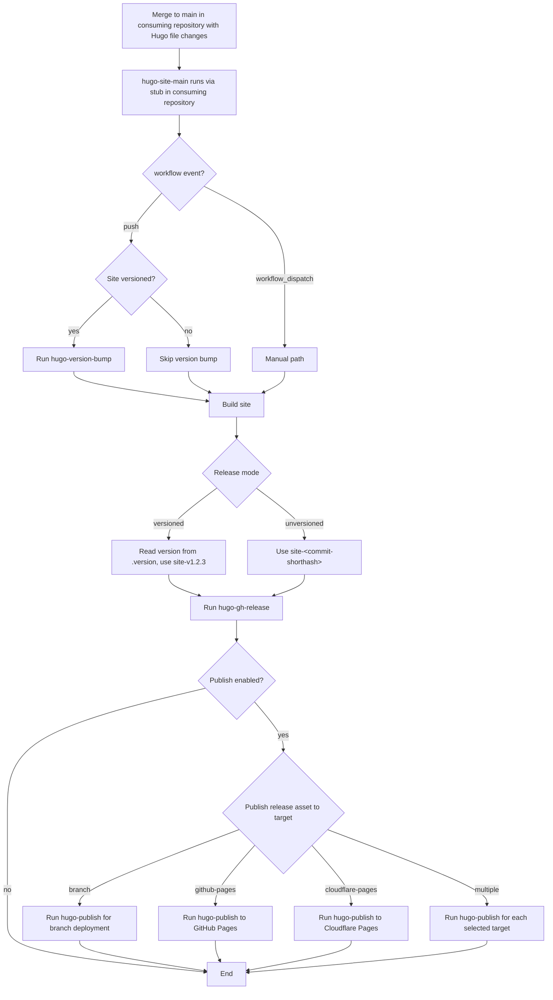
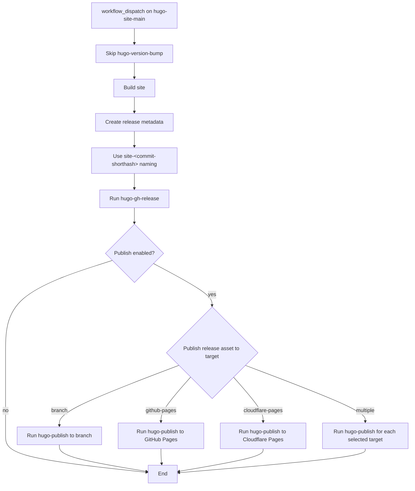

# Hugo Site Main Pipeline <!-- omit in toc -->

The `hugo-site-main` workflow is the orchestration pipeline for Hugo sites. It coordinates the shared Hugo workflows in this repository:

- [`hugo-version-bump`](../hugo-version-bump)
- [`hugo-build`](../hugo-build)
- [`hugo-gh-release`](../hugo-gh-release)
- [`hugo-publish`](../hugo-publish)

This workflow is intended to be called from a thin workflow stub in a consuming repository. The caller passes repository-specific inputs such as site path, versioning behavior, publishing options, and runner selection, and this pipeline conditionally runs the other workflows to build and release the Hugo site in the consuming repository.

Automatic runs on `push` perform the bump step only when `versioned` is true. Some of my repositories are versioned with [`bump-my-version`](https://github.com/callowayproject/bump-my-version), while others might just be a "raw" Hugo site. This pipeline supports both. Manual runs also skip the bump step.

When releasing an un-versioned site, or on manual runs, the commit short SHA is used instead of a version tag. For example, the Git tag and Github release will be named something like `site-f52f891`, and the release artifacts `site-f52f891.tar.gz` and `site-f52f891.zip`.

Publishing is optional and controlled by inputs. Currently support publish targets are:

- A branch in the repository (i.e. `gh-pages`, for repos configured to deploy from a branch)
- Github Pages
- Cloudflare Pages

## Table of Contents <!-- omit in toc -->

- [Responsibilities](#responsibilities)
- [Inputs](#inputs)
- [Secrets](#secrets)
- [Release flows](#release-flows)
  - [Automatic on merge to main](#automatic-on-merge-to-main)
  - [Manual trigger](#manual-trigger)

## Responsibilities

- Run a version bump for versioned sites on automatic runs.
- Build the Hugo site and upload to pipeline artifact.
- Create the Git tag and GitHub Release, with `.tar.gz` and `.zip` archives as release assets.
- Optionally publish to a destination such as GitHub Pages, Cloudflare Pages, etc.
- Support both automatic and manual release flows.

## Inputs

- `site-root`: Root path of the Hugo site in the caller repository.
- `versioned`: Whether the site uses versioned releases.
- `version-file`: Relative path to the version file.
- `bump-script`: Path to the version bump script in the templates repository.
- `bump-config`: Path to the bump configuration file.
- `artifact-name`: Name of the uploaded build artifact.
- `release-prefix`: Prefix used for generated release tags.
- `publish-gh-pages`: Enables publishing to GitHub Pages.
- `publish-target`: Optional alternate publish target.
- `runner-image`: Runner label or image to use.
- `templates-ref`: Ref used to checkout the templates repository for shared scripts.

## Secrets

The following secrets are required in the consuming repository (set them as Actions secrets in the repository's settings):

- `release-bot-pat`: PAT used for release PR creation and merge operations (`RELEASE_BOT_PAT`).
- `cloudflare-api-token`: Optional, used for Cloudflare publishing targets (`CLOUDFLARE_API_TOKEN`).
- `cloudflare-account-id`: Optional, used for Cloudflare publishing targets (`CLOUDFLARE_ACCOUNT_ID`).

The `RELEASE_BOT_PAT` is a [Github Personal Access Token (PAT)](https://docs.github.com/en/authentication/keeping-your-account-and-data-secure/managing-your-personal-access-tokens), and requires the following permissions:

- Actions: Read and write
- Contents: Read and write
- Workflows: Read and write

The `CLOUDFLARE_API_TOKEN` is a [Cloudflare API token](https://developers.cloudflare.com/fundamentals/api/get-started/create-token/) and requires the following permissions:

- Pages: Write

## Release flows

### Automatic on merge to main

Runs on any merge to `main` where there are changes to 1 or more Hugo site files, i.e.:

- `archetypes/**`
- `content/**`
- `data/**`
- `i18n/**`
- `static/**`
- `hugo.yml`
- `go.mod`
- `go.sum`

### Manual trigger

