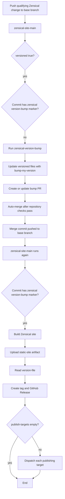
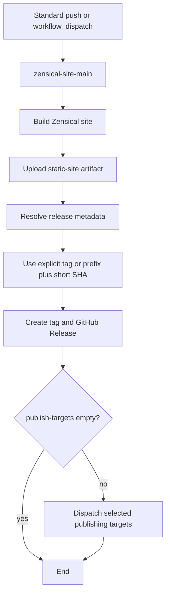

# Zensical Site Main Pipeline <!-- omit in toc -->

The `zensical-site-main` workflow is the reusable orchestration pipeline for [Zensical](https://zensical.org) documentation sites.

It coordinates these shared workflows:

- [`zensical-version-bump`](../zensical-version-bump/)
- [`zensical-build`](../zensical-build/)
- [`zensical-gh-release`](../zensical-gh-release/)
- [`zensical-publish-dispatch`](../zensical-publish-dispatch/)
- [`zensical-publish-router`](../zensical-publish-router/)
- [`zensical-publish-branch`](../zensical-publish-branch/)
- [`zensical-publish-gh-pages`](../zensical-publish-gh-pages/)
- [`zensical-publish-cloudflare-pages`](../zensical-publish-cloudflare-pages/)

A consuming repository calls this workflow from a thin workflow stub and supplies repository-specific paths, versioning settings, release naming, runner selection, and optional publishing targets.

The pipeline supports both versioned and standard sites:

- **Versioned sites** use `bump-my-version` to create an automated version-bump pull request after qualifying source changes.
- **Standard sites** build and release the triggering commit directly using a tag derived from the release prefix and short commit SHA.
- **Manual runs** follow the standard release lane unless the workflow is explicitly called on a post-bump versioned merge commit.

## Table of Contents <!-- omit in toc -->

- [Responsibilities](#responsibilities)
- [Pipeline lanes](#pipeline-lanes)
- [Inputs](#inputs)
  - [Zensical project paths](#zensical-project-paths)
  - [Build behavior](#build-behavior)
  - [Version bump behavior](#version-bump-behavior)
  - [Release behavior](#release-behavior)
  - [Publishing behavior](#publishing-behavior)
- [Secrets](#secrets)
- [Publishing targets](#publishing-targets)
- [Release flows](#release-flows)
  - [Versioned automatic flow](#versioned-automatic-flow)
  - [Standard and manual flow](#standard-and-manual-flow)
- [Example consuming repository pipeline stub](#example-consuming-repository-pipeline-stub)

## Responsibilities

- Determine whether the triggering commit starts a version bump, completes a versioned release, or follows the standard release lane.
- Create an automated version-bump PR for qualifying versioned-site changes.
- Build the Zensical site once and upload a static-site workflow artifact.
- Create an annotated Git tag and optional GitHub Release.
- Attach `.tar.gz` and `.zip` archives of the generated site to the GitHub Release.
- Optionally publish the same artifact to GitHub Pages, Cloudflare Pages, and/or a repository branch.
- Support reusable calls from consuming repositories without requiring repository-specific shell wrappers.

## Pipeline lanes

| Lane              | Condition                                                                   | Behavior                                                                             | Default release tag            |
| ----------------- | --------------------------------------------------------------------------- | ------------------------------------------------------------------------------------ | ------------------------------ |
| Bump PR           | `push`, `versioned: true`, and the commit is not an automated bump commit   | Run `zensical-version-bump`; create/update an automated PR; do not build/release yet | None                           |
| Versioned release | `push`, `versioned: true`, and commit subject contains `bump-commit-marker` | Build, read `version-file`, tag/release, optionally publish                          | `<release-prefix>-v<version>`  |
| Standard release  | `versioned: false` or event is not `push`                                   | Build, tag/release, optionally publish                                               | `<release-prefix>-<short-sha>` |

The default automated bump marker is:

```text
[zensical-version-bump]
```

The main workflow checks for that exact marker in the final commit subject so that merging an automated bump PR does not trigger another bump PR.

## Inputs

### Zensical project paths

- `working-directory`: Repository-relative directory from which Zensical runs. Default: `"."`.
- `python-project-dir`: Repository-relative directory containing the UV project `pyproject.toml`. Default: `"."`.
- `zensical-config`: Optional path to the Zensical config. An empty value uses Zensical discovery.
- `docs-dir`: Optional documentation source directory used for validation and changed-path detection.
- `output-dir`: Repository-relative static-site output directory. Default: `"site"`.

### Build behavior

- `python-version`: Python version used by Zensical. Default: `"3.13"`.
- `uv-version`: Optional UV version.
- `strict`: Fail Zensical builds on validation warnings. Default: `true`.
- `clean`: Remove generated output and run a clean build. Default: `true`.
- `build-flags`: Additional whitespace-delimited flags passed to `zensical build`.
- `use-cache`: Enable UV dependency caching. Default: `true`.
- `cache-key-suffix`: Optional dependency cache-key suffix.
- `check-changed`: Enable changed-path build skipping for the standard lane. Default: `false`.
- `changed-paths-mode`: `default`, `replace`, or `append`.
- `changed-paths`: Newline-delimited Git pathspecs for build change detection.
- `artifact-name`: Static-site artifact name. Default: `"zensical-site"`.
- `artifact-retention-days`: Artifact retention period. Default: `7`.
- `artifact-if-no-files-found`: Artifact missing-file behavior. Default: `"error"`.
- `checkout-ref`: Optional ref to build. An empty value builds the triggering ref.
- `runner-image`: Runner image or self-hosted runner label.
- `debug-state`: Enable build-state diagnostics.

### Version bump behavior

- `versioned`: Whether the Zensical site uses automatic `bump-my-version` releases. Default: `false`.
- `version-file`: Repository-relative version file. Default: `".version"`.
- `bump-config`: Repository-relative `bump-my-version` config. Default: `".bumpversion.toml"`.
- `bump-script`: Shared PipelineTemplates Zensical bump script path.
- `bump-changed-paths-file`: Optional file containing version-bump-relevant pathspecs.
- `bump-changed-paths`: Optional inline newline-delimited version-bump-relevant pathspecs.
- `bump-pr-branch`: Branch for the automated version-bump PR.
- `bump-base-branch`: Target branch for the automated version-bump PR.
- `bump-commit-marker`: Exact marker used to recognize an automated bump merge. Default: `"[zensical-version-bump]"`.
- `templates-ref`: PipelineTemplates ref used to obtain the shared bump script. Default: `"main"`.

### Release behavior

- `release-prefix`: Prefix used for generated tags. Default: `"site"`.
- `release-tag`: Optional explicit tag.
- `release-name`: Optional explicit GitHub Release name.
- `release-version`: Optional explicit release version.
- `create-github-release`: Create a GitHub Release and attach static-site archives. Default: `true`.

### Publishing behavior

- `publish-targets`: JSON array of publish destinations. Default: `"[]"`.
- `cloudflare-pages-project`: Cloudflare Pages project name.
- `cloudflare-pages-branch`: Cloudflare Pages production or preview branch. Default: `"main"`.
- `cloudflare-wrangler-version`: Pinned Wrangler version. Default: `"4.51.0"`.
- `branch-name`: Deployment branch when `branch` is selected. Default: `"gh-pages"`.
- `branch-commit-message`: Deployment branch commit message.

## Secrets

- `release-bot-pat`: Optional PAT or GitHub App token.
- `cloudflare-api-token`: Required when publishing to `cloudflare-pages`.
- `cloudflare-account-id`: Required when publishing to `cloudflare-pages`.

For same-repository build, tag, release, Pages, and branch operations, `GITHUB_TOKEN` is normally sufficient when the caller provides appropriate permissions:

```yaml
permissions:
  contents: write
  actions: write
  pull-requests: write
  pages: write
  id-token: write
```

Use `release-bot-pat` when automated bump PR creation/updates or tag/release events must trigger downstream workflows, when repository policy limits `GITHUB_TOKEN`, or when operations need a separate bot identity.

Cloudflare publishing requires:

- `CLOUDFLARE_API_TOKEN`
- `CLOUDFLARE_ACCOUNT_ID`

The Cloudflare API token needs permission to create and deploy the selected Cloudflare Pages project.

## Publishing targets

| Target             | Workflow                                                                     | Required configuration                                             |
| ------------------ | ---------------------------------------------------------------------------- | ------------------------------------------------------------------ |
| `github-pages`     | [`zensical-publish-gh-pages`](../zensical-publish-gh-pages/)                 | GitHub Pages configured to deploy through GitHub Actions           |
| `cloudflare-pages` | [`zensical-publish-cloudflare-pages`](../zensical-publish-cloudflare-pages/) | Cloudflare account ID, API token, and Pages project name           |
| `branch`           | [`zensical-publish-branch`](../zensical-publish-branch/)                     | Target branch name and a token allowed to push repository contents |

A single build artifact is reused for every selected destination. For example:

```yaml
publish-targets: '["github-pages","cloudflare-pages","branch"]'
```

builds once, creates one release, then publishes the exact same generated site to all three destinations.

## Release flows

### Versioned automatic flow

For a versioned site, a qualifying push does not immediately create a release. It first creates or updates a version-bump pull request.



The automatic bump commit marker avoids an infinite bump loop. The merge commit is the versioned release source of truth because it contains the updated version file.

### Standard and manual flow

For non-versioned sites and manual/event-driven standard runs, the workflow builds and releases the selected ref directly.



A standard release with:

```yaml
release-prefix: "site"
```

and a commit SHA beginning with `f52f891` uses:

```text
site-f52f891
```

for the default Git tag, release name, and release archive base name.

## Example consuming repository pipeline stub

The following caller workflow builds the PipelineTemplates documentation layout:

```text
.
├── docs/
├── docs-site/
│   ├── pyproject.toml
│   ├── uv.lock
│   └── site/
└── zensical.toml
```

```yaml
---
name: Zensical Site

on:
  push:
    branches:
      - main
    paths:
      - "docs/**"
      - "docs-site/**"
      - "zensical.toml"
      - ".github/workflows/zensical-site.yml"

  workflow_dispatch:
    inputs:
      publish-targets:
        description: 'JSON array, for example ["github-pages","branch"].'
        required: false
        type: string
        default: '["github-pages"]'

      strict:
        description: "Fail the build on Zensical validation warnings."
        required: false
        type: boolean
        default: true

permissions:
  contents: write
  actions: write
  pull-requests: write
  pages: write
  id-token: write

jobs:
  site:
    uses: redjax/pipelinetemplates/.github/workflows/zensical-site-main.yml@main
    with:
      versioned: false

      python-version: "3.13"
      working-directory: "."
      python-project-dir: "docs-site"
      zensical-config: "zensical.toml"
      docs-dir: "docs"
      output-dir: "docs-site/site"

      strict: ${{ inputs.strict }}
      clean: true
      use-cache: true
      cache-key-suffix: "repository-docs"

      artifact-name: "repository-zensical-site"
      artifact-retention-days: 7
      artifact-if-no-files-found: "error"

      release-prefix: "site"
      create-github-release: true

      publish-targets: ${{ inputs.publish-targets || '["github-pages"]' }}
      branch-name: "gh-pages"

      runner-image: "ubuntu-latest"
      templates-ref: "main"

      debug-state: false
    secrets:
      release-bot-pat: ${{ secrets.RELEASE_BOT_PAT }}
      cloudflare-api-token: ${{ secrets.CLOUDFLARE_API_TOKEN }}
      cloudflare-account-id: ${{ secrets.CLOUDFLARE_ACCOUNT_ID }}
```

For a versioned Zensical site, add `.version` and `.bumpversion.toml`, then use:

```yaml
versioned: true
version-file: ".version"
bump-config: ".bumpversion.toml"

bump-base-branch: "main"
bump-pr-branch: "bump/zensical-site-version"

bump-changed-paths: |
  docs/
  docs-site/pyproject.toml
  docs-site/uv.lock
  zensical.toml
```
